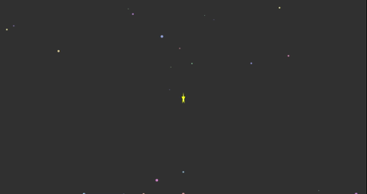

# screen-animation


It's a package what provides the JavaScript files for screen animations.

<style>
  .animation-list {
    display: grid;
    grid-template-columns: repeat(auto-fill, minmax(30%, 1fr));
    grid-gap: 1rem;
    list-style-type: none;
  }
  .animation-list li img {
    filter: grayscale(100%);
  }
  .animation-list li img:hover {
    filter: none;
  }
  @media screen and (max-width: 600px){
    .animation-list {
      grid-template-columns: repeat(auto-fill, minmax(40%, 1fr));
    }
    .animation-list li img {
      filter: none;
    }
  }
</style>
<ul class="animation-list">
  <li>
    
  </li>
  <li>
    
  </li>
  <li>
    
  </li>
  <li>
    
  </li>
  <li>
    
  </li>
  <li>
    
  </li>
  <li>
    
  </li>
  <li>
    
  </li>
  <li>
    
  </li>
  <li>
    
  </li>
  <li>
    
  </li>
  <li>
    
  </li>
  <li>
    
  </li>
</ul>

## Usage
``` html
<script src="path/to/screen-animation.js"></script>
<script>
  onStartAnimation() {
    ScreenAnimation.Sea.start();
  }
</script>
<button
  type="button"
  onclick="onStartAnimation"
>
  start animation
</button>
```

### Animations
#### Avalanche
``` javascript
ScreenAnimation.Avalanche.start({
  color: "#ff7722",
  backgroundColor: "rgba(255,255,255,0.8)"
})
```

#### Life
``` javascript
ScreenAnimation.Life.start({
  color: "#77bb99",
  backgroundColor: "rgba(0,0,0,0.6)"
})
```

#### Line
``` javascript
ScreenAnimation.Line.start({
  color: "#5588cc",
  backgroundColor: "rgba(0,0,0,0.8)"
})
```

#### Message
``` javascript
ScreenAnimation.Message.start({
  color: "#7744bb",
  backgroundColor: "rgba(0,0,0,0.4)",
  fontFamily: "fantasy",
  fontSize: "5rem",
  text: "testing.."
})
```

#### Puzzle
``` javascript
ScreenAnimation.Puzzle.start({
  color: "#883366",
  backgroundColor: "rgba(0,0,0,0.5)"
})
```

#### Rails
``` javascript
ScreenAnimation.Rails.start({
  color: "#993388",
  backgroundColor: "rgba(0,0,0,0.5)"
})
```

#### Sea
``` javascript
ScreenAnimation.Sea.start()
```

#### Sky
``` javascript
ScreenAnimation.Sky.start()
```

#### Space
``` javascript
ScreenAnimation.Space.start()
```

#### Sparkler
``` javascript
ScreenAnimation.Sparkler.start()
```

#### Star
``` javascript
ScreenAnimation.Star.start({
  backgroundColor: "rgba(0,0,0,0.8)"
})
```

#### Tetris
``` javascript
ScreenAnimation.Tetris.start({
  colors: {
    i: "#bbccee",
    o: "#448866",
    s: "#ffbbdd",
    z: "#6644cc",
    j: "#7799ee",
    l: "#aabb33",
    t: "#229944"
  },
  backgroundColor: "rgba(0,0,0,0.4)"
})
```
